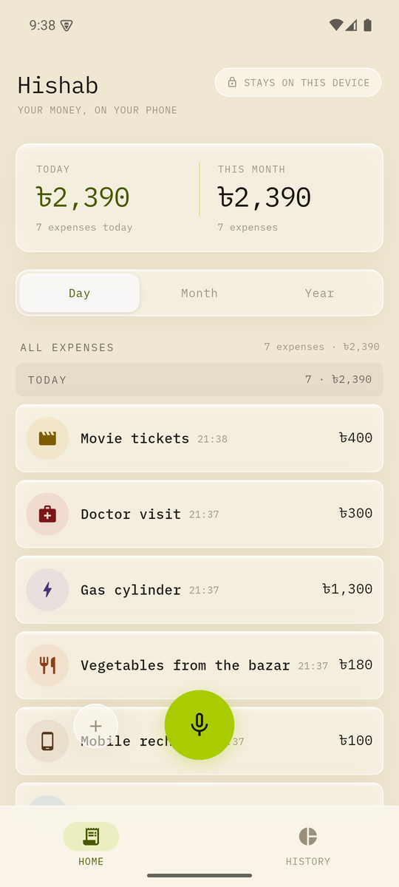
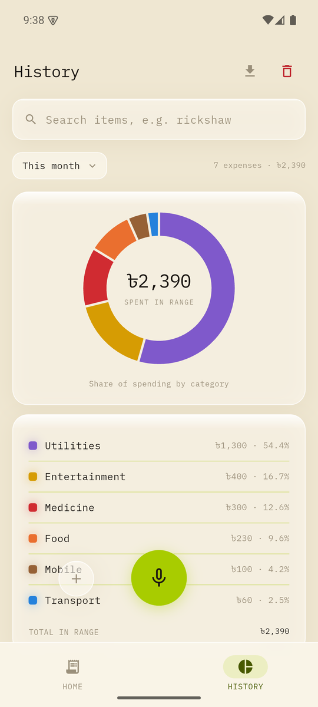
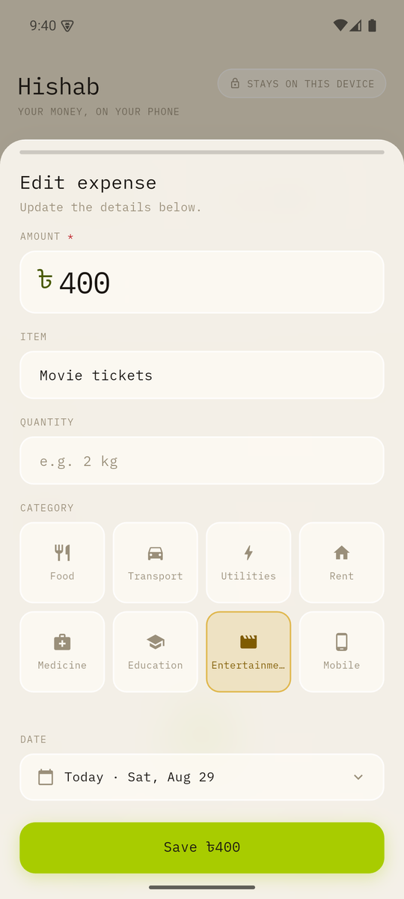
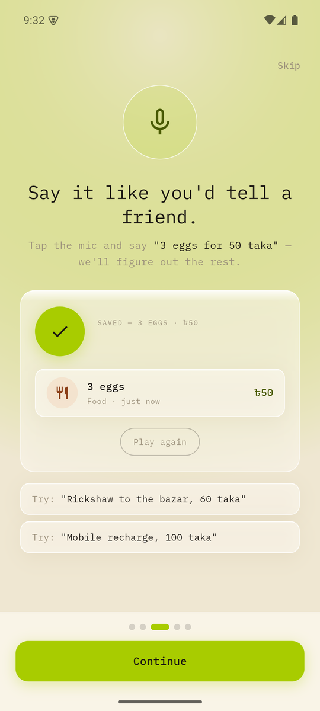
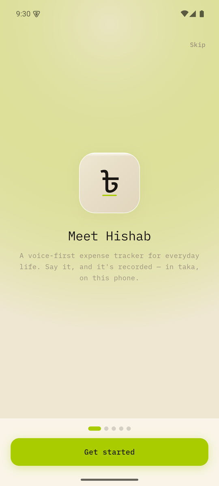

# Hishab · হিসাব

**A fully offline, voice-first expense tracker for Android.** Speak an expense in
plain English — *"bought 3 eggs for 50 taka"* — and an on-device AI turns it into
a structured record. No account, no cloud, no internet. Everything stays on your phone.

<p align="center">
  
  
  
  
  
</p>

## How it works

```
You speak
    ↓
Android SpeechRecognizer (on-device, en-US)
    ↓
Gemma 3 270M, fine-tuned — running locally via ONNX Runtime
    ↓
{ item, quantity, amount, category }
    ↓
SQLite (sqflite) → glass UI
```

The model runs entirely on the phone. Speech recognition uses Android's
on-device recognizer. Expense data never touches the network — the only time
the app uses the internet is the **one-time model download** (~513 MB from
Hugging Face, with a terms-and-progress screen, resumable). Existing v1.0
installs have their model migrated automatically.

## Features

- **Voice entry with live caption** — tap the mic, watch your words stream in,
  review the parsed expense, save. Tap to stop, 20s timeout, friendly error recovery.
- **Review before save** — every parsed expense opens a confirm sheet; incomplete
  parses ("Almost there — no amount heard") land pre-filled for a quick fix. A
  price the model drops into `quantity` is moved back to `amount` automatically.
- **Manual entry** — a type-it sheet with amount pad, category chips, and date picker.
- **Home dashboard** — Today / This month totals, day/month/year grouping with
  per-group subtotals.
- **History** — This month / Last month / All time filters, item search,
  category donut chart with legend, CSV export via the Android share sheet,
  clear-all behind a confirmation.
- **Swipe to delete with undo**, everywhere.
- **First-run onboarding** — privacy promise, an interactive mic demo, and the
  microphone permission ask.
- **8 fixed categories** (food, transport, utilities, rent, medicine, education,
  entertainment, mobile), each with its own icon and color, tuned for everyday
  spending in Bangladesh. Currency is Taka (৳), integer amounts.

## Build & run

Requirements: Flutter SDK, Android SDK (minSdk 26). The APK is now a small
shell (~110 MB fat / ~30 MB per-ABI) — the voice model is **not** bundled.
On first run the app walks through onboarding, then a one-time setup screen
downloads the model from
[Hugging Face](https://huggingface.co/ssgalib/expense-tracker-gemma)
(progress, cancel, and resume are supported). The model is stored in the
app's internal `files/models/` directory; v1.0 installs are migrated from
their bundled copy automatically.

```bash
flutter pub get
flutter run                # on a connected device/emulator
flutter build apk --release
```

## Tests

```bash
flutter test                                # unit + widget tests
flutter test integration_test -d <device>   # on-device E2E (real inference)
```

## Notes

- The model is FP16 (~513 MB): INT8/INT4 quantization broke Gemma 3's
  soft-capping, so the full-precision model ships via the one-time download
  instead of the APK.
- Inference runs an autoregressive greedy decode loop in Kotlin
  (`OnnxChannel.kt`), stopping at `<end_of_turn>`.
- The Dart side implements the Gemma BPE tokenizer (`lib/tokenizer/`) and a
  JSON repair step for occasionally-truncated model output.
- Design system: warm parchment glass + lime accent + IBM Plex Mono, ported
  1:1 from the OpenDesign prototypes in `Ui-Ux-Fully-Offline-Voice-first-Android.zip`
  and `hishab-model-download.html`.
